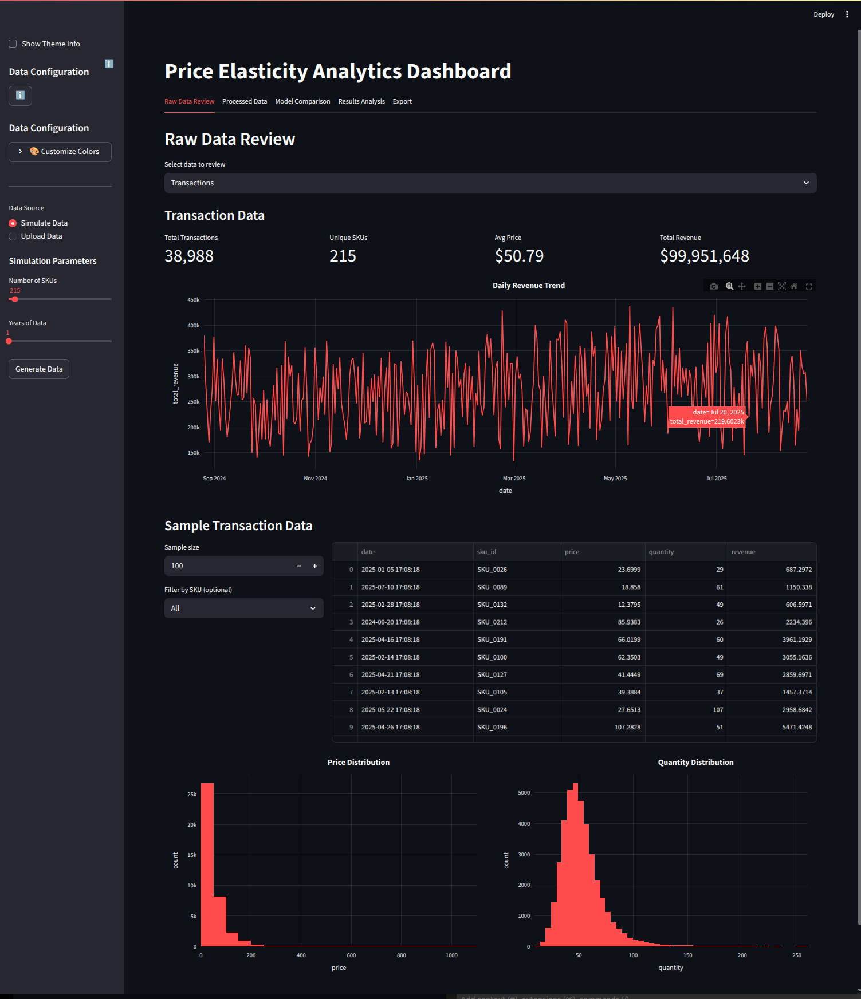
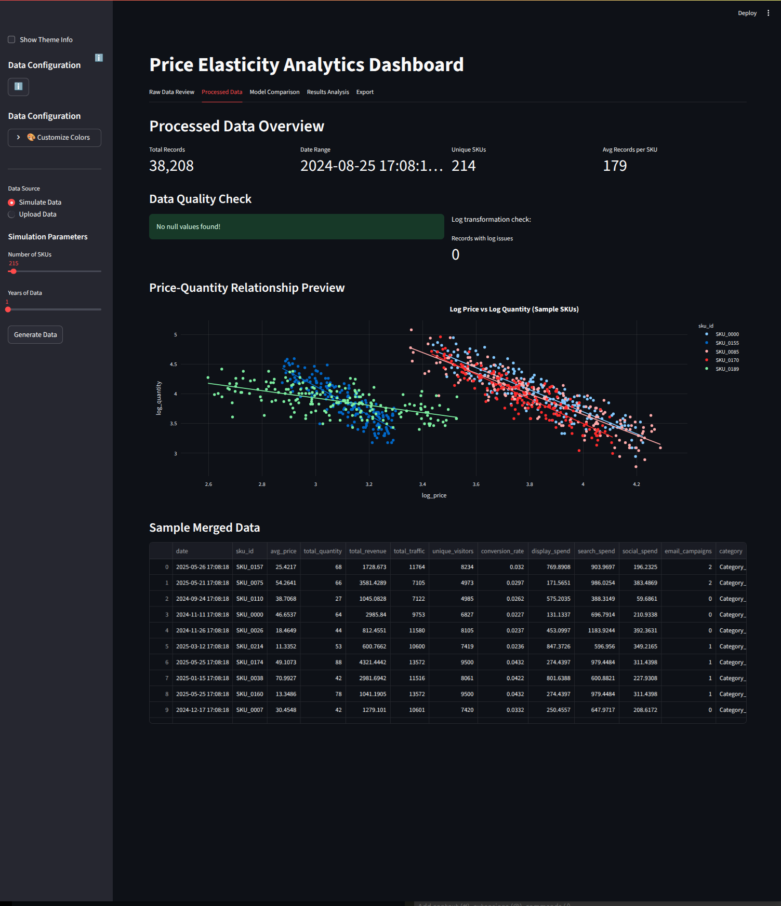
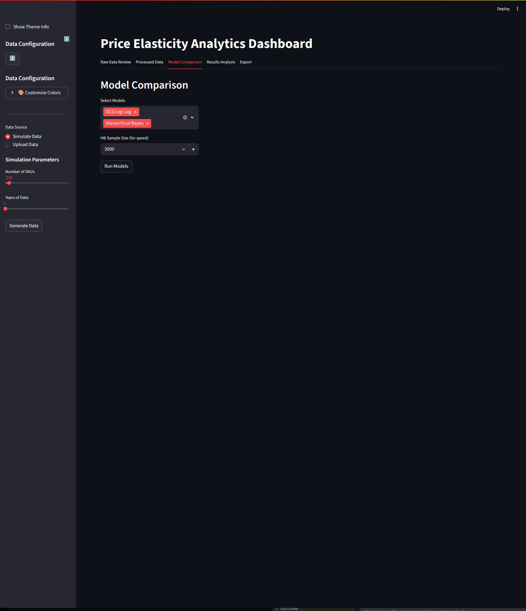
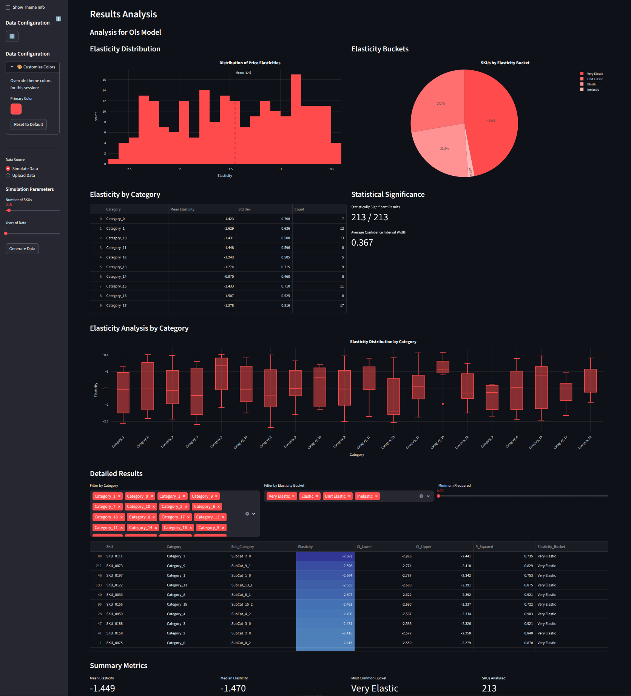
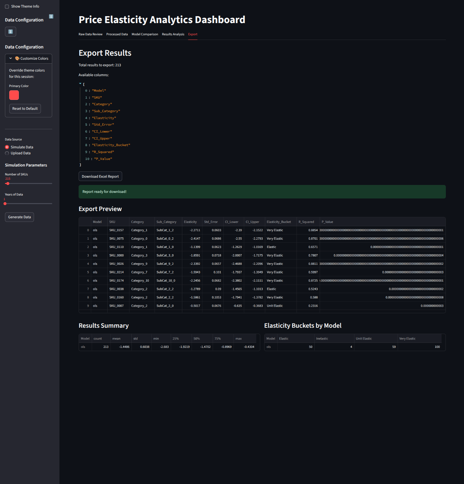

# Price Elasticity Analytics Dashboard

## Overview
The Price Elasticity Analytics Dashboard is a Streamlit-based application designed to analyze and visualize price elasticity for e-commerce data. It allows users to either simulate data or upload their own datasets to gain insights into pricing strategies and their impact on demand and revenue.

## Features
- **Data Simulation**: Generate multi-year e-commerce transaction data with customizable parameters.
- **Data Upload**: Upload your own datasets for analysis.
- **Data Cleaning and Merging**: Automatically clean and merge transaction, traffic, marketing, and SKU data.
- **Modeling**: Compare price elasticity models, including:
  - OLS Log-Log
  - Hierarchical Bayes
  - (Future Option) Machine Learning-based Elasticity Models
- **Visualization**: Interactive charts and tables for data exploration and model results.
- **Export**: Download processed data and model results.

## Pages and Screenshots

### 1. Raw Data Review
This page allows users to review the raw data uploaded or simulated. Users can inspect transactions, SKUs, traffic, and marketing data.



### 2. Processed Data
The processed data page provides an overview of the cleaned and merged dataset. It includes data quality checks and visualizations of the price-quantity relationship.



### 3. Model Comparison
On this page, users can compare different price elasticity models. The dashboard currently supports:
- OLS Log-Log
- Hierarchical Bayes
- Fixed Effects Panel



### 4. Results Analysis
This page provides detailed insights into the results of the selected model, including elasticity estimates and their implications for pricing strategies.



### 5. Export
Users can export the processed data and model results for further analysis or reporting.



## How to Run the Application
1. Clone the repository:
   ```bash
   git clone <repository-url>
   cd price-elastics-analytics
   ```
2. Activate the virtual environment:
   ```bash
   source PE_env/bin/activate
   ```
3. Install dependencies:
   ```bash
   pip install -r requirements.txt
   ```
4. Run the Streamlit app:
   ```bash
   streamlit run app.py
   ```

## File Structure
- `app.py`: Main Streamlit application.
- `data_processing.py`: Functions for cleaning and merging data.
- `data_simulation.py`: Functions for simulating e-commerce data.
- `models.py`: Price elasticity models (implementation not shown here).
- `PE_env/`: Virtual environment directory.

## Requirements
- Python 3.12
- Libraries: Streamlit, Polars, NumPy, Plotly, etc.


## License
This project is licensed under the MIT License. See the LICENSE file for details.

## Acknowledgments
Special thanks to the developers of Streamlit, Polars, and Plotly for their amazing tools that made this project possible.
